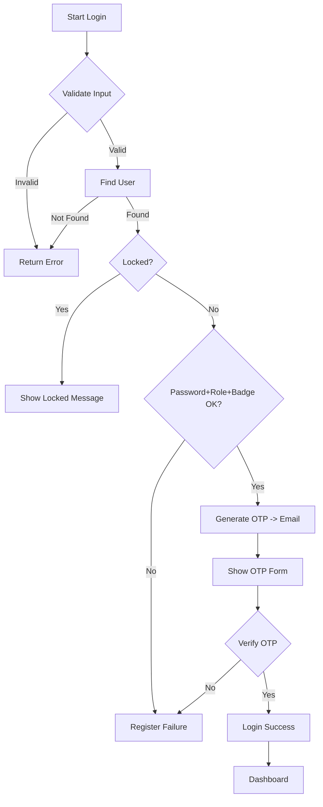

# Proses Otentikasi SistemLoginMatDis

## Ringkasan Tahap

- Tahap 1 — Definisi masalah dan aturan login
  - Input wajib: `email`, `password`, `role`, `badge_id`
  - Perbedaan cabang (3 field pembeda): `role`, `badge_id`, `otp_code` (OTP sebagai pembeda dinamis)
  - Role: Admin, Manager, Staff, User
  - Percobaan gagal sebelum lock: 3 kali → lock 10 menit

- Tahap 2 — Logika dan himpunan
  - Himpunan pengguna U = semua baris tabel `users`
  - Himpunan valid R_role = {users | badge_id sesuai pola per role}
  - Logika autentikasi: masuk ke U ∩ R_role ∩ valid_password

- Tahap 3 — Relasi dan kombinatorika
  - Relasi antara `role` dan `badge_id` adalah fungsi validasi: f(role) -> regex pattern
  - Ruang kombinasi input yang valid per role: 4 roles × 1000 badge ids (format xxx 000-999) × valid OTP states
  - Probabilitas bruteforce OTP (6 digit): 1/1_000_000 per tebak

- Tahap 4 — Kriptografi dan flowchart
  - OTP dihasilkan dengan `random_int(0,999999)` — harus dianggap OTP sementara
  - Rekomendasi: gunakan hashing HMAC atau simpan OTP yang di-hash lalu verifikasi waktu-aman
  - Flowchart (Mermaid):



- Tahap 5 — Pengujian dan laporan
  - Unit tests: valid login, invalid password, invalid badge, lockout after 3 failures, OTP expiry
  - Pengujian manual: gunakan Mailtrap untuk intercept email OTP

## Catatan Kriptografi & Kombinatorika

- OTP 6 digit: space = 10^6. Jika attacker melakukan N percobaan, probabilitas sukses ~ N/1_000_000.
- Kombinatorika badge: pola `XXX-000` memberikan 1000 kombinasi per role.
- Salt & hashing: untuk OTP, disarankan menyimpan HMAC(OTP, secret) untuk menghindari penyimpanan OTP secara plaintext.

### Key Rotation & Secrets Guidance

- Format kunci: gunakan string acak hex 32-char (16 bytes) atau lebih.
- Aplikasi sekarang mendukung banyak kunci: `OTP_KEYS` (comma-separated) dan `OTP_CURRENT` (index, default `0`).
- Saat membuat OTP baru, sistem menggunakan kunci pada posisi `OTP_CURRENT` untuk menandatangani OTP.
- Saat memverifikasi, sistem akan mencoba semua entri di `OTP_KEYS` sehingga kunci lama tetap valid untuk jangka waktu rotasi.
- Untuk merotasi kunci otomatis, gunakan perintah artisan berikut:

```bash
php artisan otp:rotate
```

Perintah ini akan menghasilkan kunci baru, menambahkannya ke awal `OTP_KEYS` di file `.env`, dan menyetel `OTP_CURRENT=0`.

Rekomendasi operasional:
- Rotasi kunci secara berkala (mis. setiap 90 hari) jika sistem memiliki kebutuhan keamanan tinggi.
- Jaga `OTP_KEYS` agar berisi kunci terbaru dulu; simpan beberapa kunci lama untuk toleransi selama transisi.
- Jangan commit `.env` ke VCS. Simpan cadangan kunci di vault aman (HashiCorp Vault, AWS Secrets Manager, atau sejenisnya).

## Logging

Semua event penting dicatat ke log Laravel (`storage/logs/laravel.log`) dengan tag:
- `[Auth] Authenticate attempt`
- `[Auth] User not found`
- `[Auth] Attempt to login to locked account`
- `[Auth] Credential/field mismatch`
- `[Auth] OTP sent`
- `[Auth] Showing OTP form`
- `[Auth] OTP failed verification`
- `[Auth] User logged in`

## Langkah Selanjutnya
1. Implementasikan hashing/HMAC untuk OTP jika diperlukan tingkat keamanan lebih tinggi.
2. Tambahkan middleware berbasis role untuk proteksi route.
3. Buat unit tests untuk skenario yang tercantum di Tahap 5.
